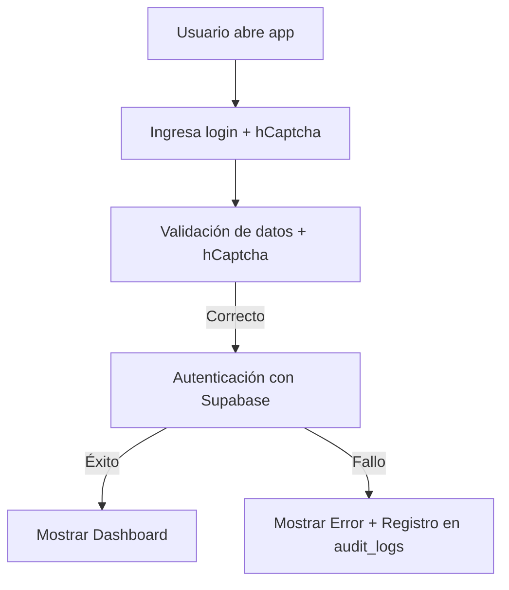

# autorizacionesColgemelli
Sistema de control de salidas estudiantiles - Colegio Gemelli

## Seguridad

La política de seguridad se definió con el encabezado estándar `Content-Security-Policy`.
Se permite `blob:` en `default-src` y `connect-src` para habilitar descargas de CSV
generadas con `URL.createObjectURL()`.
Se agregó `https://colgemelli-my.sharepoint.com` a `default-src` para mostrar fotos almacenadas en OneDrive.

# Manual de Usuario y Referencia Técnica: Sistema Web de Autorización de Salidas - Colegio Gemelli

## 1. Descripción General

El sistema web permite la gestión de autorizaciones de salida de estudiantes en el Colegio Gemelli. El sistema consta de dos archivos HTML principales:

- **index.html**: Interfaz principal del sistema.
- **diagnostico.html**: Herramientas para pruebas de conectividad y depuración.

Las funcionalidades incluyen autenticación, panel de control, autorizaciones, administración de datos y auditoría.

---

## 2. Estructura del Proyecto

```
autorizacionesColgemelli/
├─ index.html         # Aplicación principal
├─ diagnostico.html   # Herramientas de diagnóstico
└─ README.md          # Documentación breve
```

---

## 3. Tecnologías Utilizadas

- **HTML, CSS y JavaScript** para la interfaz y lógica.
- **Supabase** como backend (Base de datos, autenticación y almacenamiento).
- **Chart.js** para visualización de datos.
- **hCaptcha** como protección antispam.
- **CryptoJS** para manejo de contraseñas.

---

## 4. index.html: Descripción Funcional

### 4.1 Inicio de Sesión

- Ubicado en el elemento `#loginSection`.
- Utiliza hCaptcha y validaciones básicas.
- Llama a la función `login()` para validar credenciales con Supabase.
- Registra eventos en `audit_logs` con `logSecurityEvent()`.

### 4.2 Configuración de Supabase

```js
const SUPABASE_URL = 'https://mbosvnmhnbrslfwlfcxu.supabase.co';
const SUPABASE_ANON_KEY = '...';
supabase = window.supabase.createClient(SUPABASE_URL, SUPABASE_ANON_KEY, {
    auth: {
        persistSession: false,
        autoRefreshToken: false
    }
});
```

### 4.3 Panel de Control (Dashboard)

- Se activa tras la autenticación con `showSection('dashboard')`.
- Se carga información estadística con `loadDashboard()`.
- Se visualiza usando Chart.js con fallback por si falla la librería.

### 4.4 Módulos

- **Autorizaciones**: Confirmar o denegar salidas.
- **Verificaciones**: Revisar salidas autorizadas.
- **Administración**: Gestionar estudiantes, motivos, grados y usuarios.
- **Historial**: Consultar eventos pasados.

### 4.5 Seguridad

- Sanitización de HTML para evitar XSS.
- Rate limiting por cliente.
- Encabezados CSP definidos en el HTML.

---

## 5. diagnostico.html: Herramientas de Verificación

Incluye pruebas de conectividad divididas en pasos:

```html
<h3>📋 Pasos de Diagnóstico:</h3>
<button onclick="step1()">1. Verificar URLs</button>
<button onclick="step2()">2. Probar Conexión</button>
<button onclick="step3()">3. Verificar Tablas</button>
<button onclick="step4()">4. Verificar Usuarios</button>
<button onclick="step5()">5. Probar Login</button>
```

Cada función emplea llamadas a Supabase y muestra resultados en un log visible.

---

## 6. Conceptos Clave

- **Supabase**: Provee almacenamiento, autenticación y consultas.
- **Chart.js**: Visualiza gráficos. Compatible con fallback si no se carga correctamente.
- **Autenticación y Seguridad**: Protegida por hCaptcha y CryptoJS.
- **Auditoría**: Registro de eventos importantes como inicios de sesión o fallos.

---

## 7. Diagrama de Flujo: Autenticación y Panel



---

## 8. Recomendaciones para Desarrolladores

- Revisar tablas en Supabase: campos, relaciones y validaciones.
- Profundizar en **JavaScript moderno** (promesas, async/await).
- Aprender sobre **DOM** y **manipulación segura de HTML**.
- Consultar documentación oficial de Chart.js y Supabase.
- Usar `diagnostico.html` ante cualquier error o desconexión inesperada.

---

## 9. Consideraciones de Seguridad Adicional

- Se recomienda eliminar scripts inline y moverlos a archivos externos.
- Aplicar Subresource Integrity (SRI) a librerías externas.
- Implementar tokens CSRF efectivos para formularios críticos.
- El login debe migrarse a validación en servidor para evitar exponer hashes.

---

## 10. Contacto y Soporte

Para soporte técnico o solicitudes de mejora, contactar al equipo de desarrollo de TI del Colegio Gemelli.

---

Este manual sirve como referencia para usuarios técnicos y funcionales que deseen comprender, mantener o escalar la aplicación.

