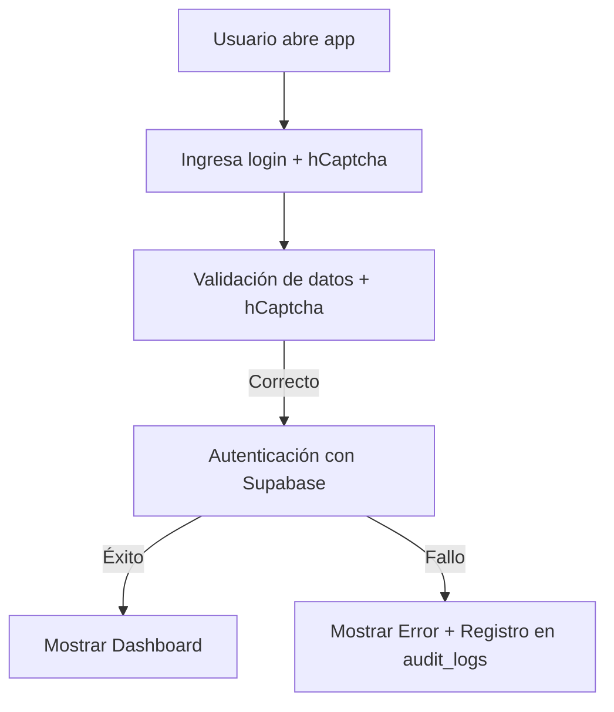

# autorizacionesColgemelli
Sistema de control de salidas estudiantiles - Colegio Gemelli

## Seguridad

La política de seguridad se definió con el encabezado estándar `Content-Security-Policy`.
Se permite `blob:` en `default-src` y `connect-src` para habilitar descargas de CSV
generadas con `URL.createObjectURL()`.
Se agregó `https://colgemelli-my.sharepoint.com` a `default-src` para mostrar fotos almacenadas en OneDrive.

# Manual de Usuario y Referencia Técnica: Sistema Web de Autorización de Salidas - Colegio Gemelli

## 1. Descripción General

El sistema web permite la gestión de autorizaciones de salida de estudiantes en el Colegio Gemelli. El sistema consta de dos archivos HTML principales:

- **index.html**: Interfaz principal del sistema.
- **diagnostico.html**: Herramientas para pruebas de conectividad y depuración.

Las funcionalidades incluyen autenticación, panel de control, autorizaciones, administración de datos y auditoría.

---

## 2. Estructura del Proyecto

```
autorizacionesColgemelli/
├─ index.html         # Aplicación principal
├─ diagnostico.html   # Herramientas de diagnóstico
└─ README.md          # Documentación breve
```

---

## 3. Tecnologías Utilizadas

- **HTML, CSS y JavaScript** para la interfaz y lógica.
- **Supabase** como backend (Base de datos, autenticación y almacenamiento).
- **Chart.js** para visualización de datos.
- **hCaptcha** como protección antispam.
- **CryptoJS** para manejo de contraseñas.

## Variables de Entorno Requeridas

Antes de construir o desplegar la aplicación se deben definir las siguientes variables de entorno:

- `SUPABASE_URL` – URL de tu instancia de Supabase.
- `SUPABASE_ANON_KEY` – clave anónima pública del proyecto.

Estas variables se utilizan durante el proceso de construcción para generar un archivo `env.js` que queda disponible en tiempo de ejecución.
En la raíz del repositorio también se provee `env.example.js` con valores de ejemplo. Puedes copiarlo como `env.js` y reemplazar los datos por los de tu proyecto si prefieres configurarlo manualmente.
Para preparar el entorno local sigue los pasos:

1. Exporta las variables en tu terminal:

   ```bash
   export SUPABASE_URL="<tu-url>"
   export SUPABASE_ANON_KEY="<tu-anon-key>"
   ```

2. Ejecuta el script de construcción que generará `env.js`:

   ```bash
   ./build.sh
   ```

3. Asegúrate de que el archivo `env.js` se haya creado en la raíz del proyecto antes de abrir `index.html` en tu navegador.

## 4. index.html: Descripción Funcional

### 4.1 Inicio de Sesión

- Ubicado en el elemento `#loginSection`.
- Utiliza hCaptcha y validaciones básicas.
- Llama a la función `login()` para validar credenciales con Supabase.
- Registra eventos en `audit_logs` con `logSecurityEvent()`.

### 4.2 Configuración de Supabase

```js
const SUPABASE_URL = process.env.SUPABASE_URL;
const SUPABASE_ANON_KEY = process.env.SUPABASE_ANON_KEY;
supabase = window.supabase.createClient(SUPABASE_URL, SUPABASE_ANON_KEY, {
    auth: {
        persistSession: false,
        autoRefreshToken: false
    }
});
```

### 4.3 Panel de Control (Dashboard)

- Se activa tras la autenticación con `showSection('dashboard')`.
- Se carga información estadística con `loadDashboard()`.
- Se visualiza usando Chart.js con fallback por si falla la librería.

### 4.4 Módulos

- **Autorizaciones**: Confirmar o denegar salidas.
- **Verificaciones**: Revisar salidas autorizadas.
- **Administración**: Gestionar estudiantes, motivos, grados y usuarios.
- **Historial**: Consultar eventos pasados.

### 4.5 Seguridad

- Sanitización de HTML para evitar XSS.
- Rate limiting centralizado en Supabase mediante la tabla `login_attempts`.
- Encabezados CSP definidos en el HTML.

Para ejecutar correctamente estas herramientas necesitas un archivo `env.js` con
tus credenciales de Supabase. Genera este archivo ejecutando:

```bash
SUPABASE_URL=https://tu-proyecto.supabase.co \
SUPABASE_ANON_KEY=clave_publica ./build.sh
```
Si lo prefieres, copia `env.example.js` a `env.js` y edita los valores manualmente.

Coloca `env.js` junto a `diagnostico.html` y abre el archivo en tu navegador.
Allí podrás introducir manualmente un correo y contraseña válidos para las
pruebas de login.

## 5. diagnostico.html: Herramientas de Verificación

Incluye pruebas de conectividad divididas en pasos:

```html
<h3>📋 Pasos de Diagnóstico:</h3>
<button onclick="step1()">1. Verificar URLs</button>
<button onclick="step2()">2. Probar Conexión</button>
<button onclick="step3()">3. Verificar Tablas</button>
<button onclick="step4()">4. Verificar Usuarios</button>
<button onclick="step5()">5. Probar Login</button>
```

Cada función emplea llamadas a Supabase y muestra resultados en un log visible.

---

## 6. Conceptos Clave

- **Supabase**: Provee almacenamiento, autenticación y consultas.
- **Chart.js**: Visualiza gráficos. Compatible con fallback si no se carga correctamente.
- **Autenticación y Seguridad**: Protegida por hCaptcha y CryptoJS.
- **Auditoría**: Registro de eventos importantes como inicios de sesión o fallos.

---

## 7. Diagrama de Flujo: Autenticación y Panel



---

## 8. Recomendaciones para Desarrolladores

- Revisar tablas en Supabase: campos, relaciones y validaciones.
- Profundizar en **JavaScript moderno** (promesas, async/await).
- Aprender sobre **DOM** y **manipulación segura de HTML**.
- Consultar documentación oficial de Chart.js y Supabase.
- Usar `diagnostico.html` ante cualquier error o desconexión inesperada.

---

## 9. Consideraciones de Seguridad Adicional

- Se recomienda eliminar scripts inline y moverlos a archivos externos.
- Aplicar Subresource Integrity (SRI) a librerías externas.
- Implementar tokens CSRF efectivos para formularios críticos.
- El login debe migrarse a validación en servidor para evitar exponer hashes.

---

## 10. Contacto y Soporte

Para soporte técnico o solicitudes de mejora, contactar al equipo de desarrollo de TI del Colegio Gemelli.

## 11. Políticas de Supabase y RLS

Para impedir que la clave pública anónima acceda a tablas sensibles, habilita Row Level Security (RLS) y define políticas que solo permitan operaciones a usuarios autenticados.

1. Activa RLS en `usuarios`:
   ```sql
   alter table public.usuarios enable row level security;
   ```
2. Otorga permisos solo a roles autenticados (cualquier rol distinto de `anon`):
   ```sql
   create policy "usuarios_read_authenticated" on public.usuarios
     for select
     using (auth.role() <> 'anon');

   create policy "usuarios_write_authenticated" on public.usuarios
     for insert, update
     with check (auth.role() <> 'anon');

   create policy "usuarios_delete_authenticated" on public.usuarios
     for delete
     using (auth.role() <> 'anon');
   ```

El archivo [`supabase/policies.sql`](supabase/policies.sql) contiene estas instrucciones para aplicarlas desde la CLI o la consola SQL de Supabase.


## 12. Ejecutar pruebas

Para correr las pruebas del proyecto utiliza el siguiente comando:

```bash
npm test
```

Este comando mostrará "No tests" ya que actualmente no hay pruebas automáticas configuradas.

## 13. Solución de problemas

1. **Generar `env.js`**
   Ejecuta `./build.sh` con las variables `SUPABASE_URL` y `SUPABASE_ANON_KEY` exportadas. El script genera un archivo `env.js` que debe ubicarse junto a `index.html` y `diagnostico.html` para que ambas páginas carguen las credenciales de Supabase correctamente.

2. **Actualizar Content-Security-Policy**
   El archivo `index.html` define una política CSP que sólo permite conectarse a `mbosvnmhnbrslfwlfcxu.supabase.co`. Si tu proyecto usa otra instancia, modifica el dominio en la meta etiqueta `Content-Security-Policy` para evitar bloqueos de conexión.

3. **Verificar conectividad**
   Después de generar `env.js`, abre `diagnostico.html` en tu navegador. Utiliza los botones numerados para comprobar las URLs, las tablas y el inicio de sesión. Los resultados de cada paso se muestran en el área de log.
